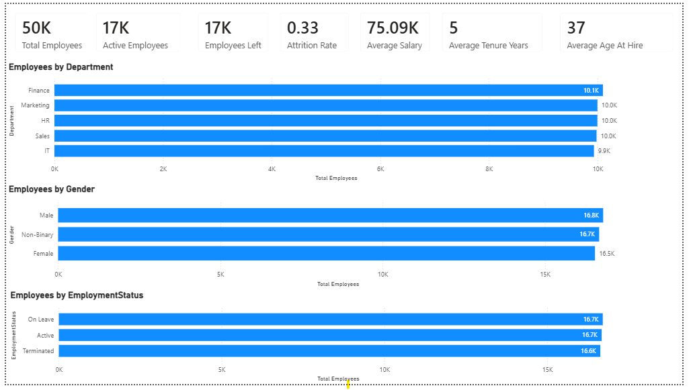
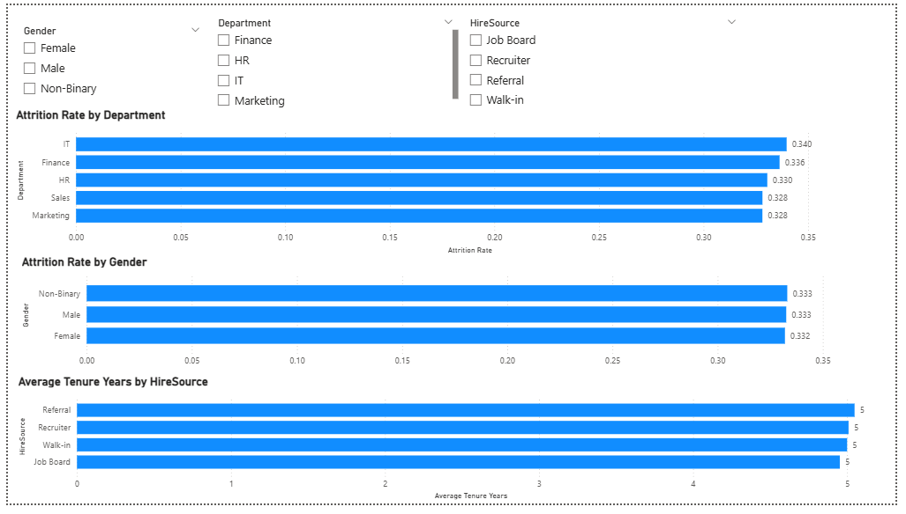

# HR Analytics

## Project Overview

An end-to-end HR analytics project on a 50,000-employee dataset. I checked the data first,
cleaned the issues I found, then used Python to look for patterns. After that I used SQL to
answer the main HR questions, and Power BI to present the results.

## Business Problem

HR wants to understand employee attrition — who is leaving, and whether it's associated with
department, pay, performance, engagement, or how someone was hired.

## Objectives

- Understand the workforce (who works here, how long, in what department)
- Check whether attrition is higher in some groups than others
- Check whether pay, performance, and engagement line up the way you'd expect
- Report findings honestly, even when the answer is "no meaningful pattern found"

## Dataset

`01_raw_data/HR_raw_data.csv` — 50,000 rows (1 row = 1 employee), 40 columns. Covers
department, job title, salary, bonus, performance, engagement, satisfaction, stress, tenure,
promotions, recruitment, and employment status/termination info.

## Tools Used

- **Excel** — first look at the data, basic cleaning checks, COUNTIF/COUNTIFS/AVERAGEIF summaries
- **Python (pandas)** — deeper cleaning, data quality flags, exploratory analysis
- **MySQL** — business questions answered with GROUP BY / aggregate SQL
- **Power BI** — 2-page dashboard
- **GitHub** — this repo

## Project Workflow

```
Raw data → Excel → Python → MySQL → Power BI
```

## Data Cleaning

Checked in Excel, confirmed and handled in Python (`03_python/HR_Analysis.py`):
- No duplicate rows, `EmployeeID` is a clean primary key
- 3,373 rows have an impossible age at hire (under 16 years old) — flagged, not deleted
- 23,789 rows (47.6%) show more completed projects than assigned projects — flagged
- ~20,800 rows have a promotion count but no promotion date — left as-is, documented
- `SupervisorID` doesn't reliably map to one `SupervisorName`, so it was dropped from the
  analysis dataset (kept in the raw file)

Nothing was deleted or guessed at — issues are flagged with new columns
(`AgeAtHireFlag`, `ProjectsIssueFlag`) so anyone using the cleaned data can see them.

## Exploratory Analysis

Full script: `03_python/HR_Analysis.py`. Checked attrition, salary, performance, stress, hire
source, retention risk, and promotions against each other. Headline result: none of these show
a meaningful relationship in this dataset — every group comparison came out close to equal, and
every correlation came out close to zero.

## SQL Analysis

`04_sql/HR_Analysis.sql` — table setup, data validation, KPIs, and business-question queries
(department, salary, attrition, hire source, retention risk). Every number in that file was
checked against the same data before writing it, so the queries return exactly what's reported
here.

## Power BI Dashboard

`05_powerbi/PowerBI-Dashboard.pbix` — 2 pages:

### Page 1


- **Page 1 — Workforce Overview** (`page-1.png`): KPI cards for Total Employees, Active
  Employees, Employees Left, Attrition Rate, Average Salary, Average Tenure, and Average Age
  At Hire, plus breakdowns of employees by Department, Gender, and Employment Status.
 
### Page 2


- **Page 2 — Attrition Analysis** (`page-2.png`): slicers for Gender, Department, and
  HireSource, with Attrition Rate by Department, Attrition Rate by Gender, and Average Tenure
  by Hire Source.

## Key Insights

- Overall attrition rate: 33.3%. By department: 32.8%–34.0% — no real standout (visible on
  the dashboard's Page 2).
- Correlation between performance rating and salary: -0.005 — essentially no relationship.
- Gender pay gap: under 0.4% — not meaningful. Attrition by gender is also nearly identical
  (33.2%–33.3%, see Page 2).
- Hire source doesn't relate to tenure or performance — all four sources land within a few
  weeks of each other on average tenure.
- `RetentionRisk` labels don't line up with engagement or satisfaction scores when checked in
  Python — "High" risk employees score about the same as "Low" risk employees.

## Recommendations

- Don't target retention efforts at one department or gender — the differences in this data
  are within normal random variation, not a real gap.
- Review how `RetentionRisk` is calculated — it doesn't currently reflect the
  engagement/satisfaction data it would normally be based on.
- Fix data quality issues (impossible ages, project count mismatches, missing promotion
  dates) at the source system rather than downstream.
- Before using this data for real decisions, confirm it reflects real employee records — the
  very even splits across department, gender, and hire source, combined with the lack of any
  expected correlations, suggest this dataset was generated for practice rather than captured
  from an actual company.

## Project Structure

```
HR-Analytics/
├── 01_raw_data/       Original CSV, untouched
├── 02_excel/          HR_Initial_Analysis.xlsx
├── 03_python/         HR_Analysis.py + HR_cleaned_data.csv
├── 04_sql/            HR_Analysis.sql
├── 05_powerbi/        PowerBI-Dashboard.pbix + cleaned data + page screenshots
└── README.md          This file
```

## Skills Demonstrated

Data cleaning and validation, Excel formulas (COUNTIF/COUNTIFS/SUMIF/SUMIFS/AVERAGEIF),
pandas, basic statistics (correlation, group comparison), SQL (GROUP BY, aggregate functions,
CASE), Power BI dashboard design (DAX measures, slicers), and writing findings for a
non-technical audience without overstating what the data supports.
